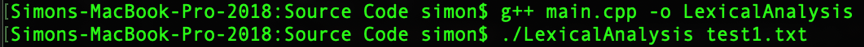
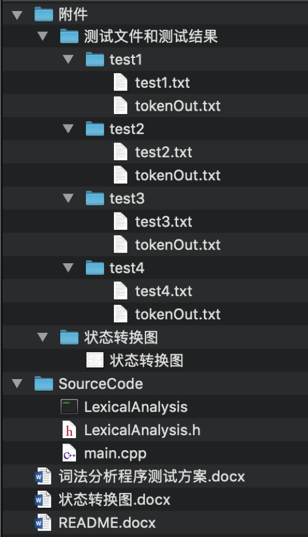

**1.**	代码运行

代码的编译和运行通过命令行终端实现，先是进入到Source Code文件夹，然后运行以下两个命令

分别是使用g++编译器编译生成Unix可执行文件LexicalAnalysis，接着运行该可执行文件，后面需要附上所要执行的文件名称作为main函数的参数，才可对所选文件进行词法分析，如果没有参数，则程序会运行错误。

**2.**	文件说明

附件中有四个测试文件和其所生成的tokenOut.txt文件，保存在“词法分析程序实验提交/附件/测试文件和测试结果/testX”，X有1、2、3和4，意味着不同的测试用例。

附件中还有状态转换图，保存在在“词法分析程序实验提交/附件/状态转换图”。

源代码保存在“词法分析程序实验提交/ SourceCode”中，包含有LexicalAnalysis.h、main.cpp文件和名称为LexicalAnalysis的Unix可执行文件

***整个压缩包文件框架如下***

